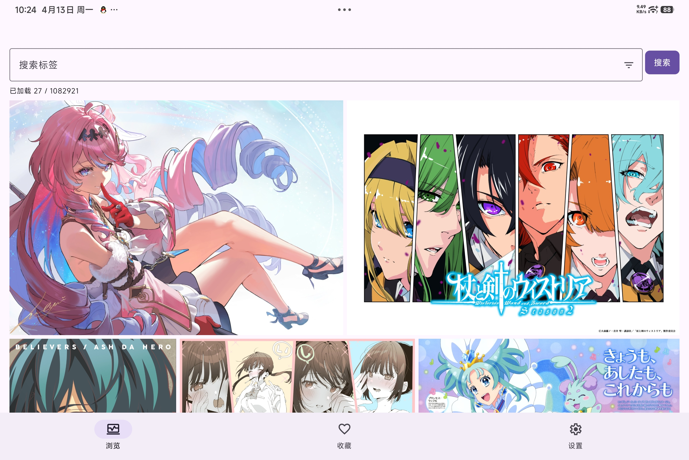
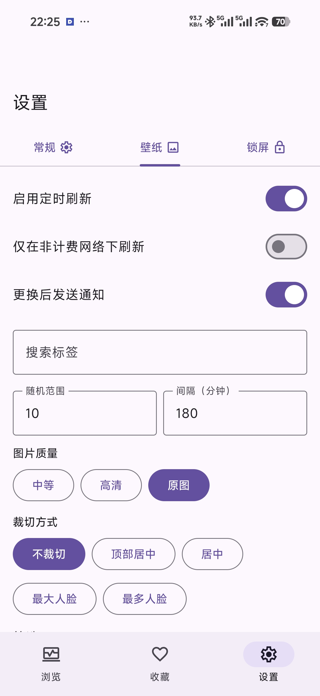

# Andere for Android

`Andere` 是一个面向 `yande.re` 的 Android 图片浏览与壁纸客户端。

Android 版代码由 AI 辅助编写。产品灵感来自 [UWP 版项目](https://github.com/AmazingDM/PRPR)。

## 截图预览

| | |
|---|---|
|  |  |

## 当前功能

- 浏览 `yande.re` 图片，支持搜索、联想、分页加载与本地筛选。
- 浏览页支持 `小 / 中 / 大` 三档图片尺寸，尺寸越大，每页显示图片越少。
- 图片详情页支持：
  - 收藏 / 取消收藏
  - 设为壁纸
  - 设为锁屏
  - 打开原帖与来源链接
  - 点击标签直接返回浏览页搜索
  - 长按标签快速加入壁纸/锁屏搜索词、黑名单，或编辑标签中文备注
- 设置页支持：
  - 壁纸与锁屏分别配置刷新规则
  - 锁屏可选择“使用和壁纸同一图片”
  - 图片质量、裁剪模式、刷新间隔、随机范围、最近记录显示条数、去重保留天数
  - 手动刷新、最近记录查看与清空
  - 标签翻译手动同步与自动同步
- 支持本地收藏列表。
- 支持保存图片到系统图片目录下的 `Pictures/Andere`。

## 标签翻译

标签翻译数据来自 [danbooru-tags-translation](https://github.com/sw1313/danbooru-tags-translation)，App 不内置翻译数据，首次使用需手动或自动同步。

- 搜索与输入时显示中文标签提示。
- 在设置页手动同步最新翻译。
- 通过 `WorkManager` 按小时自动同步翻译。
- 配置 GitHub PAT 后执行上传后再下载的合并同步流程。
- 详情页长按标签后，可直接补充中文翻译或备注。

## 壁纸与锁屏刷新

刷新任务通过 `WorkManager` 调度，核心特点：

- 壁纸和锁屏可以独立启用。
- 支持非计费网络限制。
- 支持随机候选池与去重保留天数。
- 周期任务使用较小的 flex 窗口，尽量贴近设定时间执行。
- 厂商系统对后台限制较严格时，实际触发时间仍可能晚于计划时间。

锁屏壁纸是否可单独设置依赖设备 ROM 能力；不支持的设备会自动退化为仅壁纸流程。

## 项目结构

- `app/src/main/java/com/andere/android/domain/`
  - 数据模型、过滤逻辑、候选图选择与搜索用例
- `app/src/main/java/com/andere/android/data/`
  - API 请求、XML 解析、Room 数据库、DataStore 配置、标签翻译仓库
- `app/src/main/java/com/andere/android/system/`
  - WorkManager、壁纸应用、图片下载、保存与处理
- `app/src/main/java/com/andere/android/ui/`
  - Compose UI、ViewModel、通用输入组件

## 构建要求

- Android Studio Koala 或更新版本
- JDK 17
- Android SDK 35
- 最低系统版本：Android 8.0（API 26）

## 构建与运行

在 `android/` 目录下执行：

```bash
./gradlew :app:assembleDebug
```

仅验证 Kotlin 编译可执行：

```bash
./gradlew :app:compileDebugKotlin
```

安装包标识：

- App name: `Andere`
- Application ID: `com.andere.android`
- Namespace: `com.andere.android`

## 权限说明

`AndroidManifest.xml` 中当前使用的权限：

- `INTERNET`
  - 访问 `yande.re` 与标签同步源
- `ACCESS_NETWORK_STATE`
  - 判断网络状态与非计费网络限制
- `SET_WALLPAPER`
  - 应用壁纸
- `SET_WALLPAPER_HINTS`
  - 壁纸相关扩展能力
- `RECEIVE_BOOT_COMPLETED`
  - 开机后恢复自动刷新/同步调度
- `POST_NOTIFICATIONS`
  - 显示壁纸刷新通知（Android 13+）

## 已知限制

- `WorkManager` 不是精确定时器，系统省电策略可能让任务延后。
- 锁屏壁纸支持情况依赖设备厂商实现。
- 大图浏览与下载速度受 `yande.re` 网络状态影响明显。
- 目前 Android 版不包含登录、评分、评论、投票等社区交互功能。

## 第三方资源与数据来源

### 图标

本项目使用 [Material Symbols & Icons](https://fonts.google.com/icons)，遵循 [Apache License 2.0](https://www.apache.org/licenses/LICENSE-2.0)。

### 标签翻译数据

- 标签列表通过 [yande.re Tag API](https://yande.re/tag.json?limit=0) 获取
- 中文翻译由 [DeepSeek V3.2](https://www.deepseek.com/) 批量生成，部分经人工校对
- 翻译数据托管于 [danbooru-tags-translation](https://github.com/sw1313/danbooru-tags-translation)

## 开发说明

- 本项目代码由 AI 辅助生成。
- 当前浏览页使用基于比例的 justified 行布局，以兼顾瀑布感与稳定滚动体验。
- 标签翻译仓库为性能做了索引与缓存优化，避免几十万条词库直接拖慢冷启动与联想速度。

## 许可证

本项目基于 [MIT License](LICENSE) 开源。
